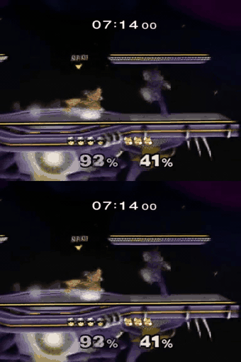
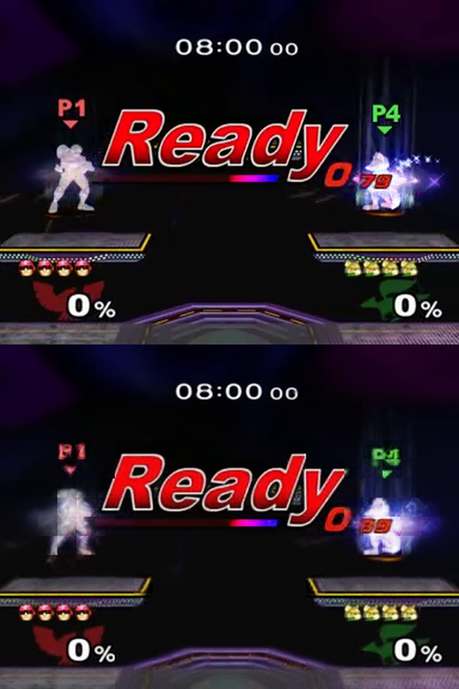

# melee-wm

A world model of Super Smash Bros. Melee, built with the [MIRA](https://github.com/mira-wm/mira)
recipe: a DINOv3-RAE codec and a 200M-parameter latent diffusion world model with diffusion
forcing, conditioned on both players' controller inputs as a single 32-key action stream.

Fox vs Captain Falcon on Battlefield, trained on 717 games of Slippi replays rendered to video.
It runs at 20 fps on one GPU with headroom, and can be played from a browser.

*Same seed and same initial noise. Top is the baseline, bottom has the jump input held from
t=2 s. Identical until the intervention, then divergent.*

Results and the full measurement chain: [RESULTS.md](RESULTS.md). Design decisions and the
dataset format: [DESIGN.md](DESIGN.md). Recordings in [`bench/videos/`](bench/videos/): the
intervention pair above, a 30 s continuous rollout, and a live human-played session.

## What works

Each criterion was written down before the runs, not after.

| | |
|---|---|
| Long rollouts | 30 s on a real action stream with no collapse |
| Action adherence | A byte-identical control arm diffs to exactly 0.000, so divergence after a forced input is attributable to that input |
| Speed | 66 ms median per latent at 2 diffusion steps, against a 100 ms real-time budget |
| Interactive | Websocket server and browser client, recorded server-side at a true 20 fps |

## What does not work, and why

The codec reconstructs the stage, HUD and text almost perfectly, and the two fighters 9.66 dB
worse.

*Held-out clip, codec round-trip only. The timer, "Ready", the damage percentages and the
platforms survive. Both fighters are smears.*

On 40 held-out clips: background 26.61 dB, characters 16.95 dB, whole frame 25.61 dB. MIRA
Table 7 reports 27.6 dB whole-frame for their Base codec.

Three explanations were tested and rejected:

| Hypothesis | Test | Result |
|---|---|---|
| The characters are small | PSNR against on-screen size | 16.91 vs 16.99 dB, no size dependence |
| The loss is swamped by 97% static background | Motion-weighted decoder fine-tune against a +0.3 dB gate registered beforehand | +0.17 dB, gate failed |
| The decoder is at fault | Linear and MLP probes from latents to character location | R2 gain of +0.006 and -0.003 over a position-only prior |

Character location is not recoverable from the latent beyond a static positional prior, so the
encoder discards the players. No amount of further decoder or world-model training moves that
ceiling; it needs a new encoder, which invalidates every latent and forces a world-model retrain.

This is one 200M model trained on 36 hours of video, roughly 0.4% of MIRA's data, and characters
are located by motion on a coarse 9x12 latent grid. A model at MIRA's scale may not show it.

## Dataset

Replays come from [erickfm/slippi-public-dataset-v3.7](https://huggingface.co/datasets/erickfm/slippi-public-dataset-v3.7).
`data/select_games.py` filters it to 2-player Fox vs Captain Falcon games on Battlefield,
`download.py` fetches and parses them into per-frame actions and state, `render/` plays them back
through Slippi Dolphin under xvfb to get video, and `package.py` writes MIRA's WebDataset layout.

    python data/select_games.py
    python data/download.py
    bash render/render_all.sh
    python data/package.py <video_dir> <npz_dir> <out_dir>

Melee has one shared camera, so `n_players: 1` and both players' inputs share a 32-key vocabulary.
The rendered video is not redistributed here.

## Training

Configs are in `mira_configs/`. `bench/setup_wm.sh` builds the environment on a fresh machine,
then:

    bash bench/codec_run.sh      # codec, 80k steps
    bash bench/wm_run.sh         # world model, 100k steps

The codec needs the gated DINOv3-L/16 weights in `RS_DINO_WEIGHTS_DIR`. `model=latent_world_model`
hardcodes a 512 px width for Rocket League, so Melee needs
`model.architecture.config.video.width=384`.

## Evaluation

    python bench/codec_audit.py        # character vs background PSNR
    python bench/char_probe.py         # linear and MLP probes on the latents
    python bench/intervention.py       # action adherence with a null control
    python bench/long_real.py          # 30 s rollout on a real action stream
    python bench/speed_sweep.py        # latency against diffusion steps

Raw output for every number quoted in [RESULTS.md](RESULTS.md) is in `bench/results/`.

## Playing it

`bench/play_server.py` steps the model one latent per message and returns decoded frames;
`bench/play.html` is the client. Point the page at a host with `?ws=wss://host:port`, or tunnel to
it and use the default.

    python bench/play_server.py --steps 2

Arrows are the P1 stick, `Z`/`X`/`C` are A/B/jump, `WASD` and `1`/`2`/`3` drive P2.

## Requirements

A GPU with 32 GB of VRAM, [MIRA](https://github.com/mira-wm/mira), the gated DINOv3-L/16 weights,
and a Melee 1.02 ISO, which is not distributable. Scripts under `bench/` and `render/` assume a
working tree at `/workspace`; they are the scripts that produced the numbers rather than a
general-purpose CLI. `pyproject.toml` covers data preparation only, and the training environment
is built by `bench/setup_wm.sh`.

Model weights: `justincg/melee-wm-weights` on Hugging Face.
